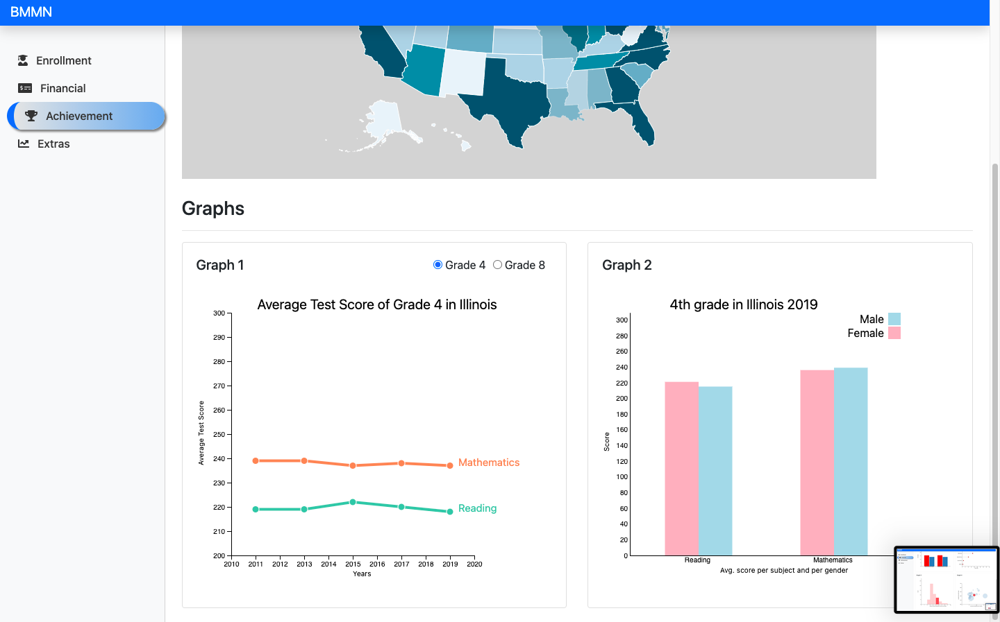

# CSC 468 Final Project (Team BMMN)

## Description
This dashboard is using the data from U.S. Education Dataset: Unification Project dataset from Kaggle website to visualize various Enrollment, Financial and Student's Test Achevements data from 2006 to 2019.

## Navigation
All of the tabs have coropleth of the US with which a user can interact by clicking on desired state. Selecting a state will change the data accordingly. 

# Enrollment tab
The line chart graph shows enrollment per grade per year for grades 1 to 12. Pie chart two and three show female and male enrollment per ethnicity from 2009 to 2016 years selectable in the dropdown menu.

# Financial tab
The first bar graph shows revenue and expenditure per student comparing state and national average (actual dollar amount). 
Dot chart shows revenues and expenditures with dollar amount in millions and is ordered by types expenditures and revenues.
Next, bar chart shows each bar count that represents number of states in that bar where actual dollar amount showing support service expenditure per student.
Bubble chart in the end represent states and size of Instruction expenditure per student.

# Achievement tab
The line chart shows average test scores in Math and Reading for grades 4 and 8 by year. The bar chart compares between male and female test score in math and reading. Selecting grade above line chart toggles data between 4th and 8th grade in line and bar chart.

### Directions to run the project
### Step 1: Create a kaggle.com account and setup API access in order to download the dataset
1. Navigate to the Kaggle homepage at www.kaggle.com -> Your Account -> Create New API token
2. Move kaggle.json to C:\Users\\[user name]\\.kaggle or ~/.kaggle/ depending on your OS.

### Step 2: Confirm you have installed the required Python libraries
1. kaggle
2. pandas
3. matplotlib
4. seaborn
5. numpy
6. flask
7. geopandas

### Step 3: Run download_data.py

### Step 4: Run explore_data.py
We used this file to perform data exlporation so we could determine what we wanted to visualize using D3.js. The output of this file will give you an idea of why we took the direction that we did.

### Step 5: Run viz_project.py
This will launch the web server.

